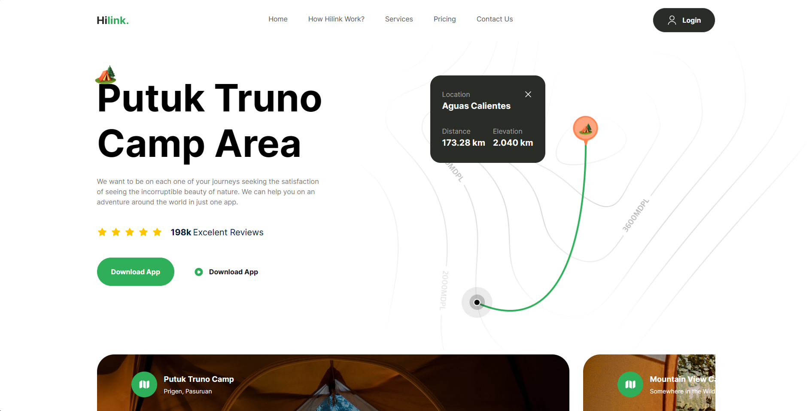

### Hilink

#### Project Preview

#### Description

Hilink is a web application that provides users with a platform to explore and join outdoor adventures around the world. The application offers features such as real-time maps that can be used offline, adventure scheduling, augmented reality technology to guide users on their hiking trails, and new locations every month.

#### Installation and Configuration

To set up the project locally, follow these steps:

1. Clone the repository to your local machine.
2. Install the required dependencies by running `npm install` or `yarn install`.
3. Start the development server by running `npm start` or `yarn start`.

The application should now be running on `http://localhost:3000`.

#### Contributing

If you'd like to contribute to the project, please feel free to submit a pull request or open an issue to discuss your ideas.